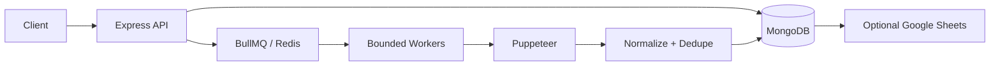

# LeadFlow — Asynchronous Business Lead Collection Platform

LeadFlow is a modular backend for collecting public business-listing data. It demonstrates why slow, failure-prone browser automation belongs behind a REST API and durable queue—not inside an HTTP request.

## Architecture



## Engineering value

- API requests validate input, persist a `queued` job, and immediately return `202`.
- A BullMQ worker handles `queued → running → completed/failed/cancelled`, with durable progress, result counts, timestamps, and error message.
- `MAX_CONCURRENT_JOBS` defaults to 2 because each scrape owns Chromium. Browser closure is guaranteed with `finally`.
- Centralized selector candidates, navigation timeouts, isolated listing failures, and configurable exponential-backoff retries improve resilience without attempting CAPTCHA bypasses or stealth evasion.
- Text, phone, and URLs are normalized. WhatsApp remains null unless a real WhatsApp link is found.
- Deterministic dedupe uses normalized phone → Maps URL → website → name + address. MongoDB unique indexes backstop process-memory checks.
- Helmet, CORS allow-list, payload limits, rate limiting, Zod input validation, and redacted structured Pino logs are included.

## Data flow and database design

`POST /api/jobs` → validate → persist Job → enqueue Redis message → worker scrapes → normalize → persist non-duplicates → optional Sheets append. A Job stores query, requested result count, lifecycle status, progress, lead/duplicate counts, timestamps, queue ID, and safe failure message. A Lead stores name, raw and normalized phone, optional verified WhatsApp URL, address, website, Maps URL, rating/reviews, category, source, and timestamps. Sparse unique indexes cover phone, website, Maps URL, and name/address.

## Job processing, retries, and concurrency

BullMQ owns job-level retries using `JOB_ATTEMPTS` and `BACKOFF_DELAY_MS`; this avoids multiplying retries in both scraper and queue layers. Queue history is retained for one day (completed) or seven days (failed), bounded to 1,000 records each. Cancellation uses conditional database updates, so it cannot overwrite a terminal state or lose a race to completion. The worker concurrency limit is deliberately low and configurable: more parallel Chromium instances increases RAM/CPU pressure and increases the chance of unstable automation.

## Tech stack

Node.js, Express, MongoDB/Mongoose, Redis/BullMQ, Puppeteer, Google Sheets API, Pino, Zod, Vitest, Docker, and GitHub Actions.

## API

| Endpoint | Purpose |
| --- | --- |
| `POST /api/jobs` | Queue `{ business, location, maxResults }` |
| `GET /api/jobs`, `GET /api/jobs/:id` | List or inspect jobs |
| `POST /api/jobs/:id/cancel` | Cancel an eligible job |
| `GET /api/leads`, `GET /api/leads/:id`, `DELETE /api/leads/:id` | Manage leads |
| `GET /api/stats` | Lead and job metrics |
| `GET /api/health` | Database-aware health response |

```bash
curl -X POST http://localhost:3000/api/jobs -H 'content-type: application/json' -d '{"business":"dentist","location":"Delhi","maxResults":50}'
```

## Setup

```bash
cp .env.example .env
npm install
npm start       # API
npm run worker  # another terminal
npm run scrape -- dentist Delhi 50
```

Configure `MONGODB_URI` and `REDIS_URL`; set `GOOGLE_SHEET_ID` and `GOOGLE_APPLICATION_CREDENTIALS` only for Sheets export. Never commit credential JSON or `.env`. Docker starts API, worker, MongoDB, and Redis with `docker compose up --build`.

### Environment variables

`PORT`, `MONGODB_URI`, `REDIS_URL`, `MAX_CONCURRENT_JOBS`, `SCRAPE_TIMEOUT_MS`, `JOB_ATTEMPTS`, and `BACKOFF_DELAY_MS` configure core behavior. `GOOGLE_SHEET_ID` and `GOOGLE_APPLICATION_CREDENTIALS` enable optional export. See `.env.example` for defaults.

## Testing and CI/CD

Run `npm test`, `npm run lint`, and `npm run build`. The GitHub Actions workflow runs the same install/lint/test/build pipeline for pushes and pull requests. Integration tests should use disposable MongoDB/Redis containers in CI rather than live services; browser calls should always stay mocked.

## Reliability and limitations

Retries are limited to transient navigation/browser failures, using 1s, 2s, then 4s delays. Google Maps markup changes require selector maintenance. Sheets export is best-effort and cannot fail a completed scrape. Tests mock external behavior by testing pure normalization, dedupe, and retry utilities; they never scrape Maps.

This project does not bypass CAPTCHAs, evade anti-bot systems, verify WhatsApp accounts, or automate outreach. Users must comply with applicable terms, privacy laws, and consent requirements.

## Current limitations

- A worker process can still be interrupted by an OS crash; BullMQ will detect stalled queue work, but a production deployment should add alerting and a reconciliation process for stale `running` records.
- Google Maps DOM and access controls are outside this application's control. The scraper intentionally does not evade them.
- Sheets export happens after database persistence and is logged as best-effort; it is not yet persisted as a separate export record.
- Offset pagination is appropriate for the current portfolio scale; cursor pagination is better for very large datasets.

## Design decisions and future improvements

This is intentionally a modular monolith: one API and one independently scalable worker process, rather than a microservice fleet. The Sheets integration is isolated and best-effort because storage is the source of truth. Useful next steps are authenticated users, an OpenAPI UI, selector health metrics, a manual review workflow, and test-container integration coverage.

## Interview talking points

1. Why did we use a job queue instead of holding an HTTP connection open?
2. How does bounded Puppeteer concurrency protect host resources?
3. Why do we combine multiple dedupe signals with database constraints?
4. How do you distinguish retryable from permanent failures?
5. What would you add next: authentication, selector observability, browser pooling, or a review queue?
